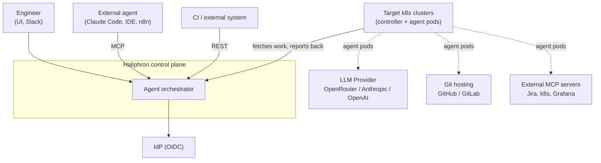
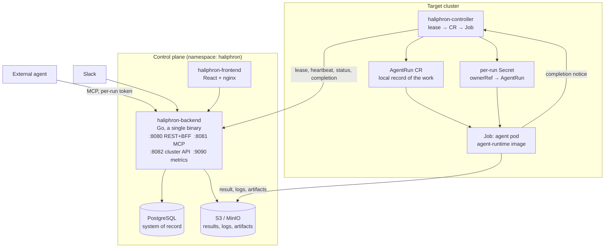
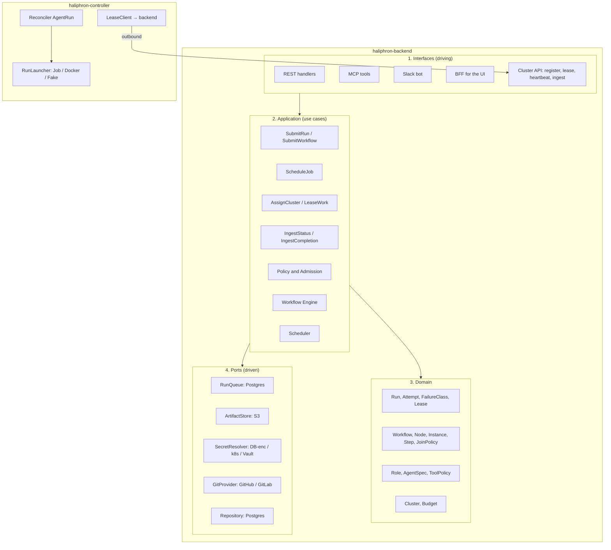
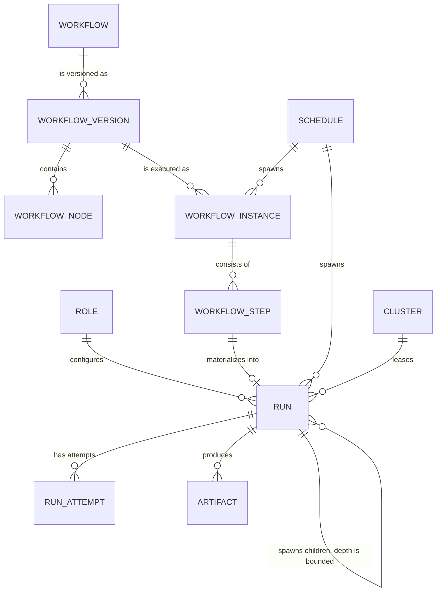
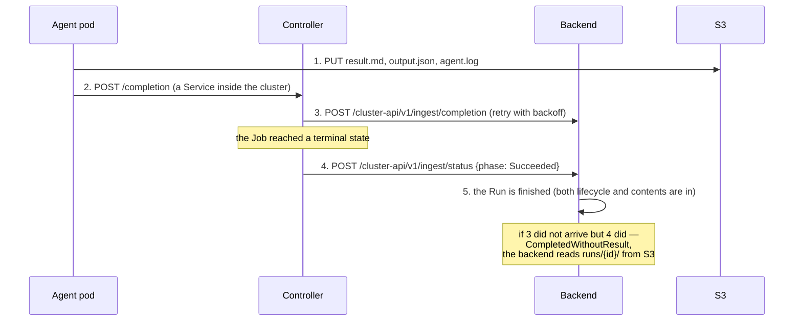
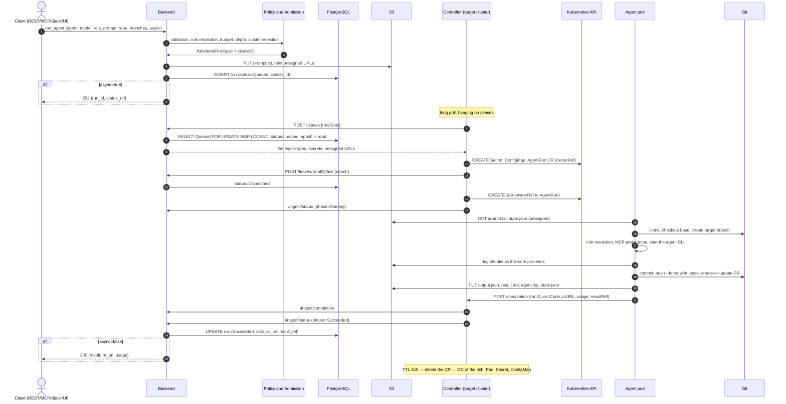
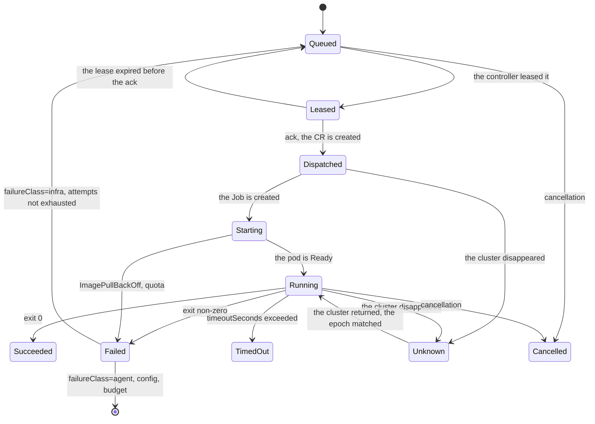
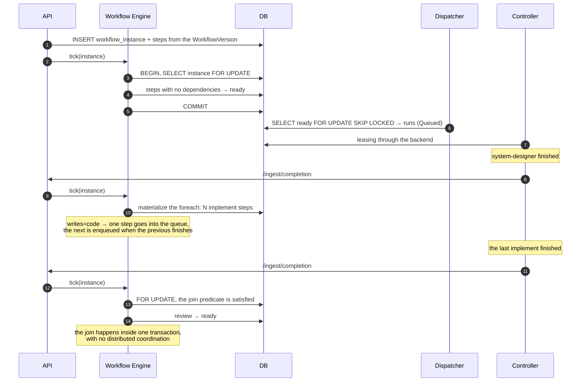

# Haliphron — architectural decision

Status: accepted for system design
Date: 2026-09-16
Requirements source: [agent-orkestrator.md](../agent-orkestrator.md)

The contracts worked out (normative; this document is their rationale):
- Cluster API — [semantics](contracts/cluster-api.md), [OpenAPI](../api/cluster/v1/openapi.yaml)
- CRD `AgentRun` — [semantics](contracts/agentrun-crd.md), [Go types](../api/agentrun/v1alpha1), [manifest](../config/crd/bases/haliphron.io_agentruns.yaml)
- The agent image runtime contract — [semantics](contracts/agent-runtime.md), [webhook and schemas](../api/runtime/v1), [constants](../api/run/v1/runtime.go)
- The state store — [semantics](contracts/run-store.md), [migrations](../db/migrations), [contract queries](../db/queries)

## 0. Decisions made

### Top level

| Decision | Choice | Consequence |
|---|---|---|
| Delivery model | On-prem, single tenant, a Helm chart | Secrets through k8s Secret/ExternalSecrets, without per-organization quotas or billing. `tenant_id` is in the DB schema but unused |
| Workflow engine | Our own, a durable state machine on PostgreSQL | **No additional CRDs.** The DAG is a product domain object, editable from the UI |
| Interaction with clusters | **Pull model** | The backend assigns a cluster and the controller fetches the work itself. The backend stores no cluster credentials and initiates no connections inward |
| Agent image | Written from scratch for the haliphron contract | Section 11 pins the requirements and the pitfalls collected from the production `nib/agent-runner/universal-agent` |
| Agent runtimes | claude-code, codex | opencode deferred |
| MVP | `run_agent` end to end | A vertical slice through every layer |

### Closed questions

| # | Question | Decision |
|---|---|---|
| 1 | Conflicts when editing code in parallel | Start with what is reliable: the fan-out mechanism is built in full, but for nodes that write code the parallelism is capped at one. Analysis, design, review and test planning parallelize freely. Lifting the cap is a change to a single parameter, once conflicts have been worked through |
| 2 | What counts as a successful run | Exit code 0. Nothing more. Verification (tests, review) is a separate workflow node, not part of the Run contract |
| 3 | Egress filtering by domain | Not doing it. NetworkPolicy by CIDR/port, with no requirement for FQDN policies and no egress proxy. A deliberate deferred risk (section 18) |
| 4 | Multi-cluster behind NAT | A pull model for every control plane ↔ cluster interaction |
| 5 | Live logs in a multi-cluster setup | The latency is acceptable. We do not proxy `kubectl logs -f`, only chunks into S3 |
| 6 | opencode | Not in v1 |
| 7 | CRD versioning | `v1alpha1` → `v1` through a conversion webhook |
| 8 | Repository cache | Not doing it |

---

## 1. Goals, boundaries, non-goals

### Goals
1. Running headless agents (claude-code, codex) as one-shot k8s Jobs on request from the API, MCP, Slack or the UI.
2. A role as a reusable agent configuration: prompt, tools, MCP servers, model, limits.
3. Orchestrating chains of agents with branching and reliable joining of parallel branches.
4. Running on a schedule.
5. Observability: status, logs, result, cost, PR.
6. Delivery as a single Helm chart, with a separate lightweight chart for target clusters.

### Non-goals for v1
- Multi-tenancy, billing, per-organization quotas.
- Interactive agents. An agent is one-shot: it starts, does the work, dies.
- Our own inference or LLM proxy. The agent talks to OpenRouter or a compatible endpoint directly.
- Replacing CI. Haliphron opens a PR; the customer's existing CI takes it from there.
- Verifying that the task was actually solved (see the decision on question 2).

### The key constraint that shapes the design
The agent pod executes commands generated by a model, in a repository whose contents may contain prompt injection. **The agent pod is untrusted code.** Hence: a separate namespace, no ServiceAccount token, short-lived scoped tokens, no S3 credentials in the pod, and the fact that the control plane accepts nothing from the pod directly.

---

## 2. Architectural principles

**P1. Separation of control plane and data plane.**
The control plane (backend, Postgres, UI) manages. The data plane (controllers, agent pods, object storage, git) executes and stores the results. A control plane failure does not stop running work and does not lose its results.

**P2. Only the data plane initiates connections.**
The control plane never connects to a cluster. The controller goes out for work itself and reports back itself. Consequences: clusters behind NAT work without a VPN, the backend stores no kubeconfig, and the attack surface on a cluster from the control plane is zero.

**P3. PostgreSQL is the system of record. The custom resource is ephemeral.**
The `AgentRun` CR is the controller's local record of the work it took, not a source of truth. Fully recoverable from the database, deleted by TTL.

**P4. The CR is self-sufficient.**
The controller is obliged to drive the run it took through to the end even if the backend is down. There are no references in the CR that must be resolved through the backend: secrets are references to a local Secret created by the same controller, everything else is values.

**P5. The result is durable before the callback.**
The pod first puts the result into object storage, then reports completion. The callback is a delivery optimization, not a correctness condition.

**P6. Separation of status authority.**
The controller is authoritative for the **lifecycle** (those are facts about the Job and the Pod). The agent pod is authoritative for the **contents** (result, PR URL, cost, tokens). A run is finished when both have been received, or when the controller observes a terminal state without contents (`CompletedWithoutResult`).

**P7. Determinism of the graph's shape.**
A workflow's structure is declarative and stored in the database. The agent influences the **data** — including the number of parallel branches — but not the **shape** of the graph. Otherwise reproducibility, auditability, cost predictability and the join point are all lost.

**P8. The role is a platform concept, and `settings.json` is one of its renderings.**
Agent runtimes have different configuration formats. A role is described in the platform's model and rendered for a specific runtime. Otherwise roles are not portable between agents.

---

## 3. System context (C4 L1)



Note the direction of the arrow between the control plane and the cluster: there is one, and it points out of the cluster.

External dependencies and behavior under failure:

| System | Failure | Behavior |
|---|---|---|
| LLM provider | The agent cannot work | `failureClass=agent`, retry is manual |
| Git hosting | No clone, or no PR | `infra` on the clone (auto-retry), `git` on the PR (the result is saved, and the PR is opened by a repeat attempt) |
| Target cluster | Does not fetch work | The run stays `Queued` with a reason, visible in the UI; the cluster is marked `Unreachable` for want of a heartbeat |
| Object storage | No result | `CompletedWithoutResult`; the logs are retrieved from the pod while it lives |
| Control plane | Unavailable | Runs already taken are driven to completion, and statuses accumulate in the controller and are sent later with backoff |
| OIDC | No sign-in to the UI | API tokens keep working |

---

## 4. Containers (C4 L2)



### Component inventory

| Component | Technology | Responsibility |
|---|---|---|
| `haliphron-backend` | Go + gin | REST API, MCP server, Slack adapter, BFF, workflow engine, scheduler, cluster assignment, work leasing, the run registry, policies and limits, role rendering, secret management |
| `haliphron-controller` | Go + controller-runtime | Leasing work from the backend, materializing the Secret/ConfigMap/CR, reconciling `AgentRun` → Job, classifying failures, auto-retrying the infrastructure class, reporting status, executing management commands, GC |
| `haliphron-frontend` | React + TS + Vite | Configuring clusters, roles and workflows; observing runs, logs and statistics |
| `agent-runtime` | Debian slim + agent CLIs + entrypoint | One-shot execution: clone → role → agent → commit → PR → upload → notification |
| PostgreSQL | 16+ | Configuration and state (section 9.1) |
| S3 / MinIO | — | Results, logs, artifacts (section 9.2) |

### Why the MCP server is not a separate service

In the specification the MCP server is a separate component. In the implementation it is **the same binary and the same use cases** on a separate listener, `:8081`: the `run_agent` / `run_workflow` tools are literally the same commands as the REST endpoints. A separate process would mean either duplicating database access and policies or an extra network hop.

The chart supports both modes: `--mode=all` (the default, one Deployment) and `--mode=mcp` / `--mode=api` for a split deployment, when MCP has to be exposed outward while REST stays inside the perimeter. That is a configuration decision, not an architectural one.

---

## 5. Layers and the direction of dependencies

A hexagonal layout with dependencies pointing inward. The backend and the controller are two separate processes, each with its own set of ports.



### Key ports

```go
// backend: the queue of work that controllers lease from
type RunQueue interface {
    Enqueue(ctx context.Context, run Run, clusterID ClusterID) error
    Lease(ctx context.Context, clusterID ClusterID, slots int) ([]Lease, error)
    Ack(ctx context.Context, runID RunID, epoch int64) error
    Heartbeat(ctx context.Context, clusterID ClusterID, obs []RunObservation) ([]Command, error)
    ExpireLeases(ctx context.Context, now time.Time) error
}

type ArtifactStore interface {
    PresignPut(ctx context.Context, key string, ttl time.Duration) (string, error)
    PresignPostPolicy(ctx context.Context, prefix string, ttl time.Duration) (PostPolicy, error)
    Get(ctx context.Context, key string) (io.ReadCloser, error)
    List(ctx context.Context, prefix string) ([]ObjectInfo, error)
}

type SecretResolver interface {
    Resolve(ctx context.Context, ref SecretRef) ([]byte, error)
}

type GitProvider interface {
    MintToken(ctx context.Context, repo RepoRef, ttl time.Duration) (Token, error)
    PullRequestStatus(ctx context.Context, url string) (PRStatus, error)
}

// controller: how exactly to execute the leased work
type RunLauncher interface {
    Launch(ctx context.Context, spec RenderedRunSpec) (RunHandle, error)
    Cancel(ctx context.Context, h RunHandle) error
    Observe(ctx context.Context, h RunHandle) (RunLifecycle, error)
}
```

`RunLauncher` with three implementations is not abstraction for its own sake:
- `JobLauncher` — production, a k8s Job;
- `DockerLauncher` — local development; the controller runs next to the backend and leases work **by the same protocol**, executing it through Docker. A cluster is not needed for developing anything except reconciliation, and the lease protocol stays under test the whole time;
- `FakeLauncher` — testing the workflow engine without k8s and without Docker. Without it there is nothing to test branch joining with.

---

## 6. Domain model



### Key entities

**Run** — one execution of one agent. An immutable specification plus mutable state.

States: `Queued → Leased → Dispatched → Starting → Running → {Succeeded | Failed | TimedOut | Cancelled | Unknown}`.

**`Succeeded` means exactly one thing: the agent exited with code 0.** Not "the task was solved". This is a deliberate decision (closed question 2): verifying that the work was done correctly is a separate workflow node (tests, a code-reviewer), not part of the Run contract. The wording in the UI and in reports is obliged to reflect this, or the system will systematically report success where there is none.

`Failed` is refined through `FailureClass`: `infra` | `agent` | `git` | `config` | `budget`. Whether to retry automatically depends on the class (section 12.2).

**RunAttempt** — an attempt. A retry does not create a new Run: the Run's `attempt` grows, and the branch and the S3 keys are deterministic from the `run_id`, so the repeat is idempotent. An attempt is identified by the triple `(run_id, lease_epoch, attempt)`: `attempt` resets to one on every epoch increase, and without the epoch in the key the new owner's first attempt would collide with the previous owner's accounting record.

The `attempt` counter is maintained by the **controller**, not the backend: it performs an infrastructure retry locally without asking the control plane (principle P4 — the work is played out while the backend is unavailable). The backend accepts `attempt` as a monotonically increasing value and rejects a regression.

**Lease** — a cluster's lease on a run. It carries the `epoch` (a fencing token) and **two deadlines**: `ackDeadline` (60 s by default) — the window for materializing in the cluster, and `leaseDeadline` (120 s, extended by every heartbeat) — the window of ownership over the work. The backend accepts statuses only with the current epoch.

There are two deadlines because before the `ack` and after it the risks are opposite: before it the work is guaranteed not to have started and can be reassigned immediately, after it the Job may be executing right now. A single shared deadline would force a choice between "a slow `ImagePullBackOff` looks like losing the cluster" and "a controller that crashed before creating the Job keeps the work idle for minutes".

The `epoch` is about ownership of the work and is raised only by the backend. The `attempt` is about attempts within an ownership and is raised only by the controller. A reassignment does not disturb the attempt numbering, and a local retry does not take ownership away.

**Role** — a configuration portable between runtimes:

```yaml
name: coder
defaultAgent: claude-code
defaultModel: anthropic/claude-opus-5
systemPromptFragment: |
  You are working in someone else's repository...
permissionMode: acceptEdits
toolPolicy:
  allow: [Read, Write, Edit, Grep, Glob, Bash, "mcp__github__*"]
  deny:  ["Bash(curl:*)", "mcp__k8s__delete*"]
mcpServers: [github, k8s-readonly]
skills: [go, helm-chart-scaffolding]
subagents: [code-reviewer]
limits:
  timeoutSeconds: 3600
  maxTurns: 150
  maxCostUSD: 5.00
  resources: {cpu: "2", memory: 4Gi, ephemeralStorage: 20Gi}
clusterSelector: {env: dev}     # where to execute
egressCIDRs: []                 # see section 14
image: null                     # null => the base agent-runtime
```

**Workflow / WorkflowVersion** — a DAG. Versioned: a running instance plays out the version it started with. Editing in the UI creates a new version without breaking current runs.

**WorkflowInstance / WorkflowStep** — an instance and its steps.

**Cluster** — a registered controller: name, labels, capacity, supported runtimes, `last_heartbeat_at`, status. **No credentials for accessing the cluster are stored** — they do not exist.

---

## 7. The pull model: assignment, leasing, reporting

The main change relative to the specification. The backend never connects to a cluster.

### Cluster registration

1. The operator generates a bootstrap token in the UI (one-time, with a TTL).
2. They install the `haliphron-runtime` chart with a `backendURL` and that token.
3. The controller calls `POST /cluster-api/v1/register`, passing its name, labels, k8s version, capacity, the list of supported runtimes and its public key.
4. The backend creates a `clusters` record and returns the `clusterID` and the operational parameters (heartbeat interval, `staleAfter`, lease TTL, long poll ceiling).

**The key pair is generated by the controller, not the backend.** On first start the controller creates an Ed25519 pair inside the cluster, puts the private half into its own Secret, and passes only the public half at registration. From then on it signs short-lived (≤ 5 minute) JWTs with it itself, and the backend keeps only the public key.

The alternative — a shared secret or a refresh token from which the backend issues access tokens — would give the control plane the ability to issue a valid token on behalf of any cluster. For a system whose entire threat model is built on "the control plane has no access inside the cluster" (ADR 1), that is a direct contradiction: a compromised backend gets the clusters back. With self-signing, compromising the backend gives access to what the backend already knows.

The bootstrap token is spent after use, but registration is **idempotent on the pair (token, public key)**: a repeat with the same key returns the same `clusterID`. Without this, a controller that received the response and crashed before writing the `clusterID` into its Secret is incurable — the token is spent, there is no identity, and a human with a UI is required.

### Cluster assignment

The backend picks a cluster at admission:
1. an explicit `cluster` in the request, otherwise
2. the role's `clusterSelector` by labels, otherwise
3. the default cluster.

Filters: status `Healthy`, matching labels, available capacity, support for the required runtime. On a tie, the least loaded. If there is no suitable cluster, the run stays `Queued` with the reason `NoClusterAvailable` and a visible explanation in the UI — that is waiting, not an error.

### Leasing work

```
POST /cluster-api/v1/clusters/{id}/leases     (long poll)
  Authorization: Bearer <cluster JWT>
  {"freeSlots": 3, "waitSeconds": 30}

→ 200 {"leases": [{
     "runID": "01J8X4K2...", "epoch": 1, "attempt": 1,
     "ackDeadline": "...", "leaseDeadline": "...",
     "spec": { ...RenderedRunSpec... },
     "secrets": {"git-token": "...", "llm-api-key": "...", "mcp.json": "..."},
     "artifacts": {"put": {...}, "get": {...}, "post": [...], "expiresAt": "..."}
   }]}
→ 204   (nothing available, the long poll expired)
```

**The prompt is not in `secrets`.** A k8s Secret is hard-capped at 1 MiB across all keys together, and the prompt is the only quantity with no natural ceiling: a workflow step's context absorbs the output of the previous steps. It lives in `runs/{run_id}/prompt.txt`, where the backend puts it at admission, and the pod reads it with a presigned GET. A side benefit is that the `sha256` in the reference lets the pod verify that it is executing exactly what the backend supplied.

On the backend side:

```sql
SELECT * FROM runs
 WHERE status = 'Queued' AND cluster_id = $1
 ORDER BY priority DESC, created_at
 FOR UPDATE SKIP LOCKED LIMIT $2;
-- status = 'Leased', lease_epoch = lease_epoch + 1, lease_deadline = now() + interval
```

A long poll rather than frequent polling: the connection is held until work appears or until the timeout. The secret material travels over this channel under TLS — the backend cannot create a Secret in the cluster, so the controller creates it.

### Materialization and acknowledgement

Having received a lease, the controller creates in its own namespace: a `Secret` (per-run), a `ConfigMap` (the role's fallback config) and an `AgentRun` CR with the `runID`, `epoch` and `deadline`. The Secret and the ConfigMap get an `ownerReference` to the CR — when the CR is deleted they are collected by the k8s garbage collector.

Then it acknowledges: `POST /cluster-api/v1/leases/{runID}/ack {epoch}` → the backend moves it to `Dispatched`. The point of the ack is the marker "the work became durable and will survive a controller restart"; before it, an `ackDeadline` expiry means the controller crashed without creating anything.

The ack's response carries the commands that accumulated during materialization: a cancellation that arrived between the lease being issued and the ack would otherwise wait a full heartbeat interval, having started a Job that must immediately be killed.

### Heartbeat and the management channel

Every ~10 seconds the controller sends observations and receives commands:

```
POST /cluster-api/v1/clusters/{id}/heartbeat
  {"freeSlots": 2, "reportComplete": true,
   "runs": [{"runID": "...", "epoch": 1, "attempt": 1, "phase": "Running"}]}
→ {"leases": [{"runID": "...", "epoch": 1, "leaseDeadline": "..."}],
   "commands": [{"runID": "...", "type": "cancel"}],
   "unknownRuns": []}
```

This is at once a liveness check, a lease renewal, the **only top-down management channel** and a state reconciliation. Cancelling a run is asynchronous: the delay equals the heartbeat interval. For an operation that takes minutes anyway, that is acceptable.

There are two commands. `cancel` — stop execution and drive the run to `Cancelled`, reporting the result anyway if there is one. `abandon` — the work no longer belongs to the cluster: remove the Job and the CR and **report nothing**. Separating them is mandatory: "cancel yourself" and "this is no longer your work" require opposite reporting behavior. The commands deliberately have no acknowledgements — an acknowledgement would have to be stored and to expire, while redelivering `cancel` for an already cancelled run is harmless.

**State reconciliation.** `reportComplete: true` means that `runs` contains every non-terminal run the cluster owns, and the backend may interpret the absence of an entry. Without this flag two cases are indistinguishable: "I do not have this run" (which requires a reaction) and "I have not told you about it yet" — the controller has just come up and its informer cache is not warm (which requires silence). In reply the backend sends `unknownRuns` — the runs it considers active here and the controller did not mention.

The scenario this was built for: the controller was moved with the loss of its state, or the agent namespace was recreated and all the CRs are gone. Without the reconciliation the backend waits out `staleAfter` for every run and gets a batch of `Unknown`s for manual triage. With it, it finds out in a single heartbeat.

### Loss of connectivity and fencing

If there is no heartbeat for longer than `staleAfter` (90 s by default), the cluster is marked `Unreachable` and its leases stop being renewed. What happens next depends on the run's state. An `ackDeadline` expiry is unrelated to the cluster's health here: the controller may have crashed while another replica kept answering heartbeats.

| State | Action | Why |
|---|---|---|
| `Leased`, no ack arrived, `ackDeadline` expired | Raise the epoch, return to `Queued`, reassignment is allowed | The controller crashed before creating the Job — the work definitely did not start |
| `Dispatched` / `Running`, `leaseDeadline` expired | Move to `Unknown`, **do not reassign automatically** | The Job may be executing right now. Reassignment would give two PRs and double the spend |

Runs in `Unknown` are visible in the UI; the operator decides. If the cluster comes back, the controller sends the accumulated statuses, the epoch matches and the run recovers by itself.

The backend rejects any status with a stale epoch. This protects against a "zombie" controller returning after its work has been reassigned.

**The expiry of `leaseDeadline` does not oblige the controller to stop.** The asymmetry is deliberate: the deadline is authoritative for the backend (a basis for ceasing to regard the work as belonging to the cluster) and merely informative for the controller. A controller that has lost connectivity plays out the work it took and accumulates reports — that is availability decoupling (P4). When connectivity returns, the reports are accepted if the epoch matches, and an `abandon` plus local cleanup arrive if it is stale. The opposite behavior — "the lease expired, kill the Job" — would turn a ten-second network glitch into the loss of an hour of an agent's work.

**The honest formulation of the guarantee: at-least-once execution with converging side effects.** Exactly-once is unachievable in this problem. If a double execution does happen, the `runs/{id}/state.json` checkpoint, the deterministic branch name and `create-or-update` for the PR converge on a single PR; only the token spend is doubled.

### Why a CRD is still needed

With a pull model the old argument "the backend makes one POST instead of N watches" disappears — the backend does nothing in the cluster at all. The others remain, and they are enough:

1. **The CR is the controller's durable state.** The controller is obliged to survive its own restart without losing the work it took. Without a CR it would need its own local storage. With a CR, etcd serves as that storage, for free.
2. **Pod failures are a native reconciliation task.** Eviction, `ImagePullBackOff`, OOMKill, a node drain.
3. **Availability decoupling** (P1, P4): work already taken is played out while the backend is unavailable.
4. **`kubectl` and GitOps.** For an on-prem product bought by a platform team, `kubectl get agentruns` is real value. Later it enables "adoption": a manually applied CR is executed, and the backend learns about it from the controller's report.

**One CRD, not three.** The specification names `RunAgent`, `RunAgentWorkflow` and `RunAgentJob`.

| From the specification | Decision | Why |
|---|---|---|
| `RunAgent` | **CRD `AgentRun`** | A single run is exactly what reconciliation suits: a declarative desired state, an idempotent reconcile, a terminal state |
| `RunAgentWorkflow` | **Not a CRD.** The engine lives in the backend | A DAG with fan-in, timers, branching and versioning is a long-lived transactional state machine. etcd has no cross-object transactions, no queries and no history. Plus a workflow CRD would create two writers for one piece of state |
| `RunAgentJob` | **Not a CRD.** The scheduler lives in the backend | The backend has to schedule workflows anyway. A second cron implementation in the controller is duplication |

The rules that keep the complexity of two stores in check:
- The CR carries a rendered specification with no references requiring the backend (P4).
- `.status` is small and bounded: phase, conditions, references to the Job/Pod, timestamps, attempt number, exit code, failure class, a **pointer** to the result, usage. Never the result text and never the logs.
- The controller writes no business state, only a reflection of the cluster's reality.
- The CR is deleted by TTL (24 hours after a terminal state by default), and the Secret and ConfigMap go with it by `ownerReference`.

### Reporting the result



The pod reports to the controller rather than the backend: the pod needs no egress to the control plane at all — only S3, the git host, the LLM and MCP.

**Ordering of reports.** At-least-once delivery with retries means reports arrive reordered, and a `Running` that arrives after `Succeeded` must not resurrect a run. The order is determined by the pair `(attempt, phaseRank)`, where the phase rank is `Pending 10 → Starting 20 → Running 30 → terminal 40`. Not by time: cluster clocks are not synchronized, and ordering cannot be built on them. A rank regression is ignored, the first terminal phase wins, and a growing `attempt` resets the rank. The heartbeat's observations and the `/ingest/status` reports go through the same code — they must not diverge in their rules, or the heartbeat will start rolling back state delivered by ingest.

---

## 8. The workflow engine and joining parallel branches

### The problem from the specification

> I am thinking of offloading the workflow branching implementation onto claude-code itself... system-designer does its job, launches 2 separate agents and dies. The only question is how to get back to the summarizer agent, how to wait for the parallel tasks to finish.

There is no good answer within the proposed scheme, and that is a property of the scheme rather than an oversight. If the parent dies, the join point disappears. To restore it, the last child to finish must learn that it is the last — that is distributed termination detection, which requires a shared counter with an atomic decrement, that is, precisely the external state the scheme was trying to avoid.

In addition: non-reproducibility (every run gives a different graph — nothing to show before the start, nothing to audit, no way to estimate cost), unbounded recursion, and the absence of failure semantics (a child crashed — there is nobody to retry it, there is no parent).

### The solution: the shape of the graph in the engine, the data from the agent

```yaml
name: full-development-process
version: 3
nodes:
  - key: system-designer
    role: system-designer
    writes: none
    prompt: "{{ .input.prompt }}"
    output:
      schema:
        type: object
        required: [tasks, summary]
        properties:
          tasks:
            type: array
            items:
              type: object
              required: [role, prompt, paths]

  - key: implement
    dependsOn: [system-designer]
    foreach: "{{ .steps.system-designer.output.tasks }}"   # dynamic fan-out
    writes: code                                           # => maxParallel forced to 1
    role: "{{ .item.role }}"
    prompt: "{{ .item.prompt }}"

  - key: review
    dependsOn: [implement]
    role: code-reviewer
    writes: none
    join: allTerminal      # the reviewer works even on a partly failed branch

  - key: deploy
    dependsOn: [review]
    role: deployer
    when: "{{ .steps.review.output.approved }}"
```

**Dynamic fan-out with a static join.** `system-designer` returns a list of tasks — there may be 2, there may be 7. At the moment the step finishes, the engine materializes N `implement` steps with an `iteration_key`. The `review` node depends on `implement` as a whole and becomes ready once every iteration is terminal. The same pattern as `withParam` in Argo and child workflows in Temporal.

### The `writes` attribute and parallelism (the decision on question 1)

Every node declares whether it changes code:

- `writes: none` — analysis, design, review, test planning, reports. **Parallelizes freely.** Produces `output.json` and artifacts, not commits.
- `writes: code` — editing the repository. **The engine forcibly holds no more than one such step at a time per workflow instance**, no matter how many iterations `foreach` spawned.

The fan-out mechanism is built in full; only the concurrency is capped. Once merge conflicts have been worked through in practice, lifting the cap is a change to one parameter (`maxParallel` on the node), not a rework of the engine.

The consequence: in the example above the frontend and backend developers execute sequentially, both committing into the instance's single branch. A control `merge` step is unnecessary, there are no side branches, and there are no conflicts.

### How the join actually happens

No distributed coordination. The join is a predicate inside a transaction.

```sql
BEGIN;
-- serialize all transitions of one instance
SELECT id FROM workflow_instances WHERE id = $1 FOR UPDATE;

UPDATE workflow_steps s SET status = 'ready'
WHERE s.instance_id = $1 AND s.status = 'pending'
  AND NOT EXISTS (
      SELECT 1 FROM workflow_steps d
      WHERE d.instance_id = s.instance_id
        AND d.node_key = ANY(s.depends_on)
        AND CASE s.join_policy
              WHEN 'allSuccess'  THEN d.status <> 'succeeded'
              WHEN 'allTerminal' THEN d.status NOT IN ('succeeded','failed','skipped')
              WHEN 'anySuccess'  THEN FALSE
            END
  );
COMMIT;
```

`FOR UPDATE` on the instance's row serializes all the transitions of one workflow. Two steps that finished simultaneously queue up on the lock; the second sees the first as terminal and makes `review` ready exactly once.

**This is the answer to the specification's question: it is not the agent that waits, it is the engine — because the engine does not die.**

An engine tick is triggered by three events: an instance was created, a step became terminal, a timer fired. The dispatcher separately selects the ready steps through `FOR UPDATE SKIP LOCKED` and enqueues them on the assigned cluster's queue, which makes it possible to run several backend replicas without leader election.

### The structured output contract

Dynamic fan-out works only if a step's output is machine-readable. Hence a strict contract in the platform:

- The agent writes `/workspace/.haliphron/output.json` — **the payload only**, a single JSON object. The envelope (identifiers, timestamps, status, artifact references) is filled in by the entrypoint.
- If the node declares a schema, the file is mandatory and the entrypoint validates it before uploading. No file, or a file that fails the schema → the step fails with `failureClass=agent` and an intelligible error, rather than with "empty output".
- No schema → a missing file is normal and `data` becomes `{}`. Failing a successfully completed run over a file nobody will read is pure loss.
- The human-readable summary is separate, in `result.md`; the entrypoint always writes it, using a stub when the agent produced no output.

Separating the payload from the envelope is a decision of contract 3 (delta R5): every formal requirement placed on the model is another chance to burn a paid run on a forgotten service field.

The "return JSON of this shape" requirement is inserted into the role's system prompt automatically, from the node's schema.

### Agent branching as a bounded loophole

`run_agent` from MCP inside an agent remains available, but:
- the child run is bound to its parent (`parent_run_id`) for auditing and cost accounting;
- the depth is bounded (2 by default);
- the budget is inherited from the parent's remainder;
- **in v1 it is fire-and-forget only** — the parent cannot wait for a child.

In v2 `run_agent(wait=true)` is possible: the MCP tool blocks on a long poll to the engine. In tokens it is nearly free (the model does not generate while the tool call hangs), but it keeps a pod parked and risks hitting the parent's `timeoutSeconds`. The declarative DAG remains the recommended way to branch.

### Git as the channel for passing code between steps

Code artifacts are passed through git rather than through S3 — it is natural and gives a history for free.

- A workflow instance has one branch: `haliphron/{instance_short}-{slug}`.
- Every `writes: code` step commits into it **sequentially** (guaranteed by the cap above), so there is no race for the ref.
- One PR is opened — from the instance's branch into `base_branch`.

Once the parallelism cap is lifted, a branch per iteration will be needed, plus a control merge step and a conflict-resolver agent. This is deliberately deferred (the decision on question 1).

---

## 9. Stores

### 9.1 Config storage — PostgreSQL 16+

**What is stored:** clusters, roles, workflow definitions and versions, the catalogue of agents and models, the MCP registry, users and RBAC, API tokens, schedules, budgets, **and all execution state** — runs, attempts, leases, workflow instances, steps, artifact metadata, the audit log.

**Why Postgres:**

| Option | Why not |
|---|---|
| CRD/etcd only | No cross-object transactions (the workflow engine is impossible), no queries or pagination for the UI, no history, size limits. etcd is a store of desired state, not a journal of operations |
| Consul / etcd as a KV | Does not cover the relational links: role↔run, instance↔steps, statistics queries |
| SQLite | Fine for a dev installation, but no HA and no `FOR UPDATE SKIP LOCKED` in a multi-process setup |
| A separate queue (NATS/Redis) in v1 | Unnecessary. The order of the load is hundreds to thousands of runs a day, not hundreds of thousands a second. `SKIP LOCKED` gives a correct queue on the same Postgres and adds no component to the chart. Introduce it when we hit a measurable limit |

**The schema.** Phase 1 is implemented in [db/migrations](../db/migrations); the
semantics, the invariants and what was deliberately left out of phase 1 are in
the [store contract](contracts/run-store.md). Below is the inventory; key shapes
that the contract work affected are marked.

```sql
-- configuration
clusters(id, name, labels jsonb, status, k8s_version, runtimes, crd_versions,
         capacity_slots, free_slots, quota_exhausted,
         public_key, key_id, bootstrap_token_id, controller_version,
         agent_namespace, last_heartbeat_at, registered_at)
                                            -- no credentials for access INTO a
                                            -- cluster, and no cluster private key
cluster_bootstrap_tokens(id, name, token_sha256, expires_at, max_uses, uses, ...)
roles(id, name, spec jsonb, created_at, updated_at)
secrets(id, name, kind, kek_id, dek_wrapped, nonce, ciphertext, ref_uri, ...)
api_tokens(id, name, kind, token_sha256, scopes, run_id, expires_at, last_used_at)
idempotency_keys(tenant_id, scope, key, request_sha256, run_id, expires_at)

-- phases 3 and 4
workflows, workflow_versions, workflow_instances, workflow_steps, schedules, mcp_servers

-- execution
runs(id, tenant_id, parent_run_id, depth, cluster_id,
     lease_epoch, attempt, ack_deadline, lease_deadline,
     spec jsonb, prompt_sha256, agent, model, role_name,
     repo_url, repo_provider, base_branch, target_branch, timeout_seconds,
     status, status_reason, failure_class, exit_code,
     observed_phase, observed_rank,        -- the ordering key, separate from the status
     cancel_requested_at, cancel_reason,   -- cancellation is state, not a command queue
     cost_usd, input_tokens, output_tokens, pr_url, result_summary,
     created_by, created_via, created_at, started_at, finished_at)
run_attempts(run_id, lease_epoch, attempt,  -- the key carries the epoch: attempt resets
             cluster_id, phase, phase_rank, job_name, pod_name, exit_code,
             failure_class, completion jsonb, cost_usd,
             declared_duration_ms, observed_duration_ms, started_at, finished_at)
run_cluster_exclusions(run_id, cluster_id, code, message, lease_epoch, at)
audit_log(id, at, actor, actor_kind, action, subject_kind, subject_id, payload jsonb)
```

The free-form parts (a run's spec, a role's spec, the pod's report) live in
`jsonb`: they are contracts with their own schemas and their own drift tests, and
shredding them into columns would mean a migration for every new optional field.
Everything that takes part in the engine's transactions and in the UI's queries
is a column with an index.

**The key indexes** are all partial on the status, because the status is what is
selective in every path: terminal rows number in the millions over time, while
the queue and the scanners look at dozens. `runs(cluster_id, priority DESC,
created_at) WHERE status='Queued'` serves leasing; `runs(ack_deadline) WHERE
status='Leased'` and `runs(lease_deadline) WHERE status IN ('Dispatched',
'Starting','Running')` are two deadlines, two scanners with different
consequences; `runs(cluster_id) WHERE status IN (…non-terminal…)` serves the
heartbeat reconciliation. There are no indexes on `clusters`: the table holds
dozens of rows, and `free_slots` is rewritten every ten seconds.

**`lease_epoch` is raised on the revocation of ownership, not on the issuance of
a lease** (`ackDeadline` expiry, a negative ack, an operator retry,
reassignment). Otherwise a run returned to `Queued` sits in the queue with the
very epoch the abandoned controller still holds, and its report compares as
equal — section 5 of the [store contract](contracts/run-store.md).

**Secrets.** Two modes by type:
- **Managed** — the value is encrypted at the application level (AES-256-GCM, a DEK per record, a KEK from env/file/KMS) and stored in the database. When a lease is issued it is decrypted and travels to the controller over TLS, and the controller materializes a per-run Secret with an `ownerReference` to the CR. No long-lived secrets remain in the agent namespace.
- **Referenced** — if the customer has Vault or the External Secrets Operator, only a reference lives in the database and the backend never sees the value.

Managed by default, Referenced for mature environments. Both behind the `SecretResolver` port.

### 9.2 Shared storage — S3-compatible object storage

MinIO as a subchart (a flag in values) or an external S3.

Results and logs have unbounded size, must outlive the pod, are read both by a human in the UI and by another agent, and require retention policies. Presigned links give two properties: the UI downloads directly, bypassing the backend, and the pod uploads directly, so the backend is not a bottleneck on gigabytes of logs.

**Rejected options:**

| Option | Why not |
|---|---|
| An RWX PVC | Requires NFS/CephFS, ties you to a cluster, breaks in a multi-cluster setup, and gives no lifecycle or presigned access |
| `bytea` / large objects in Postgres | Bloats the database and hurts vacuum, backup time and the recovery plan |
| ConfigMap | A hard 1 MiB limit |
| Pod logs through the k8s API only | The logs live as long as the pod does |

**Key layout:**

```
runs/{run_id}/prompt.txt
runs/{run_id}/output.json          the structured output (the contract in section 8)
runs/{run_id}/result.md            the human-readable summary
runs/{run_id}/state.json           the entrypoint's phase checkpoint (idempotent retries)
runs/{run_id}/logs/agent.log       the final log
runs/{run_id}/logs/chunks/{n}.log  incremental chunks for observing as it goes
runs/{run_id}/artifacts/**
workflows/{instance_id}/context.json
```

**A hybrid with Postgres.** The summary, up to 64 KB, is duplicated into `runs.result_summary` so that the run list and search in the UI do not hit S3 for every row. The full result is always in S3, with `result_ref` in the database.

**Pod access without S3 credentials.** The pod receives no storage keys. When issuing a lease the backend mints:
- presigned PUTs to keys known in advance (`output.json`, `result.md`, `state.json`, `logs/agent.log`), TTL = `timeoutSeconds` × 2;
- presigned GETs for `prompt.txt` and `state.json`;
- presigned POST policies for the `runs/{run_id}/artifacts/` and `runs/{run_id}/logs/chunks/` prefixes.

A compromised pod writes only into its own prefix and cannot read other runs.

**The GETs are mandatory, not decorative.** Without reading `prompt.txt` the pod will not get its task (see section 7 — the prompt does not fit in a Secret). Without reading `state.json` an idempotent retry is unachievable: the pod will not learn that the `run` phase is already past, and will pay for the LLM a second time. On the first attempt the object does not exist yet, and a 404 on that link is a normal answer.

**Reissuing the links.** A TTL of `timeoutSeconds × 2` does not survive a series of three infrastructure retries, and then the pod cannot upload the result — a failure that looks like a lost result on a successfully completed agent. Before creating the Job for an attempt past the first, the controller checks the expiry and, if necessary, takes a new bundle through `POST /cluster-api/v1/leases/{runID}/artifacts`, updating the per-run Secret.

Presigned links are secret material: they are a bearer capability to write into a specific prefix. Their place is in the per-run Secret, not in the CR's `spec` and not in environment variables that show up in `kubectl describe`.

**Lifecycle:** policies by prefix — logs 30 days, results 180, artifacts 90 (configurable). ILM for MinIO, lifecycle rules for AWS, generated by the chart.

---

## 10. Roles: model, resolution, policies

### The resolution chain (in the pod, after the clone)

The order from the specification, formalized:

1. `$REPO/.claude/settings.<role>.json` — the repository knows best
2. `/haliphron/role/settings.<role>.json` — the ConfigMap the controller created from the lease; set in the UI
3. `$REPO/.claude/settings.json` — the repository's general config
4. built-in defaults

Resolution against the repository files must happen in the pod: they do not exist before the clone. The backend renders the fallback in advance and hands it over with the lease.

### The policy ceiling

A repository cannot widen its own permissions. The effective set of tools and MCP servers:

```
effective = resolved(the chain above) ∩ role.toolPolicy.allow \ role.toolPolicy.deny
```

The intersection is computed by the entrypoint. A caveat that matters in the light of the decision on question 3: until there is egress filtering by domain, **this ceiling is the only barrier, and it is a software one**. An agent that manages to get around the configuration will reach any network address. This is an accepted risk, not a closed hole (section 18).

### Role → runtime

Two runtimes, two configuration formats. A role is rendered into the required one:

| Role concept | claude-code | codex |
|---|---|---|
| `toolPolicy.allow` | `--allowedTools` | `enabled_tools` on the MCP server + the sandbox mode |
| `permissionMode` | `--permission-mode` | `-s read-only` / `workspace-write` / bypass |
| `mcpServers` | `--mcp-config` (JSON) | `[mcp_servers.*]` in `config.toml` |
| `systemPromptFragment` | `--append-system-prompt` | a prompt prefix |
| `model` | `ANTHROPIC_MODEL` | `OPENAI_MODEL` |

An important consequence: **codex has no direct analogue of `--allowedTools` for built-in tools** — file and shell access is determined by the sandbox mode. A "read-only" role is expressed on codex through `-s read-only` and on claude-code through `permission-mode: plan` plus a deny list. The translation table must be written down explicitly and covered by tests: otherwise the same role on different agents will grant different powers, and that is a security hole rather than cosmetics.

---

## 11. The agent image and the runtime contract

The image is written for haliphron from scratch. Below are the requirements and the list of pitfalls collected from the production `nib/agent-runner/universal-agent` (a 1225-line entrypoint): it is cheaper to account for them in the design than to discover them in production.

### One image, two runtimes

Not two images. The git/PR/upload/notification logic is identical; what differs is authentication, preparing the MCP config, the launch command and parsing the output. `AGENT_TYPE` is the runtime switch, and it is also the extension point when opencode's turn comes.

A role may declare **its own image** (`role.image`), built on top of the base one: a team whose agents work with terraform and kubectl needs those binaries inside. A base image plus overlays, not a universal monster.

**Why not "upstream image + entrypoint from a ConfigMap"** (the specification's option): upstream images have no `git`, no `gh`/`glab`, no `jq`; versions drift uncontrolled; and mounting fifteen hundred lines of shell through a ConfigMap means no versioning, no tests and a 1 MiB limit. Our own image, our own tag, our own tests.

### Entrypoint phases

The phase names are contract: the checkpoint is keyed by them, `phaseTimings` in the report enumerates them, and the UI builds its timeline from them. The full table is in [agent-runtime.md](contracts/agent-runtime.md), section 3.

```
1.  init            runtime identity, directories, .git/info/exclude
2.  validate        check env, early exit with code 30 on incomplete configuration
3.  fetch           presigned GET runs/{id}/prompt.txt, sha256 check
4.  checkpoint      presigned GET runs/{id}/state.json; on a retry, skip the run phase
5.  auth            LLM credentials, git credential helper, gh/glab
6.  clone           clone, checkout base, create the target branch
7.  role            the chain from section 10, intersected with the policy
8.  mcp-prepare     render the MCP config for the runtime, secrets by reference
9.  mcp-verify      check that the servers came up (otherwise code 30)
10. run             start the agent CLI under a timeout, tee to a log file and chunks to S3
11. parse           extract result, usage, cost, session id
12. output          wrap the agent's output in the envelope, validate against the node schema
13. persist         S3: result.md, output.json, the log, state.json
14. commit          commit the leftover changes
15. push            push --force-with-lease to the deterministic branch
16. pr              create-or-update the PR/MR
17. finalize        S3: the final log, completion.json, the last state.json
18. notify          POST the completion to the controller
```

**The "upload before notification" ordering is mandatory** (P5): the result is durable before it is announced. But that alone is not enough, and this is delta R2 of contract 3: `persist` comes **before the git phases**, not after. Otherwise a failed push takes with it a result that has already been paid for — it existed only in the filesystem of a deleted pod — and an idempotent retry (ADR 19) promises what it cannot deliver.

The `checkpoint` phase gets a 404 on the first attempt — that is a normal answer rather than a failure: the object does not exist yet.

### Pitfalls the design must account for

1. **The token must not end up in `.git/config`.** Cloning through a URL with the token in it means leaving it in the repository's config, which the agent will read and send anywhere. A credential helper bound to the host is needed, plus resetting the remote to a clean URL after the clone.
2. **One token under several names.** MCP configs substitute `${GITHUB_TOKEN}`, `gh` expects `GH_TOKEN`, `glab` expects `GL_TOKEN`. Accept it under any name and re-export it under all of them, or half the scenarios break silently. Careful: with `GIT_PROVIDER=gitlab` a GitHub MCP would receive a gitlab token — incompatible combinations need an explicit prohibition.
3. **Secrets in the MCP config.** Header values must not land in the file in plaintext: export them into env and reference them (`env_http_headers` in codex, substitution in claude-code).
4. **A deterministic branch name.** The specification allows the agent to invent the name. That breaks idempotency: a second attempt would create a second branch and a second PR. The name is generated by the backend: `haliphron/{run_short}-{slug}`, with the slug derived from the prompt. The agent may propose the PR title in `output.json` — the title does not affect idempotency.
5. **The entrypoint commits, not only the agent.** The agent's commits are kept, but the entrypoint commits leftover changes by force, or the work of a crashed agent is lost entirely.
6. **`create-or-update` for the PR.** On a retry the PR already exists — find and update it rather than failing.
7. **Different agents, different usage fields.** claude-code gives `total_cost_usd`, codex gives `input_tokens`/`output_tokens`. Normalize on the way in, or budget accounting works only half the time.
8. **An early exit when the MCP servers did not come up.** An agent without the tools it was promised will not fail — it will cheerfully do something else. That is more expensive than an explicit failure.
9. **Debian slim, not Alpine.** Claude Code needs Node, and a full glibc `curl` and GNU coreutils are required.

### An init container or not

The specification assumes an init container for the clone. The decision is **one container**: the entrypoint does the clone. The clone requires the same credential helper, the same git identity and the same user as the subsequent commit and push; splitting it across containers forces the setup to be duplicated and synchronized through an emptyDir. There is no gain, and three points of divergence.

An init container is justified in one case — **downloading the input artifacts** of previous workflow steps into `/workspace/.haliphron/inputs/`: a separate responsibility with separate credentials (a presigned GET). It is introduced in phase 3, together with workflows.

---

## 12. Key flows

### 12.1 `run_agent` end to end (MVP)



### 12.2 Failure and retry



**`Succeeded` = exit code 0.** No additional checks (the decision on question 2).

**Classifying a failure by exit code** is how the controller decides whether to retry automatically. The class itself is determined by the **pod**: the controller sees only the code, while the cause exists exactly once — inside the pod at the moment of failure (contract 3, section 4).

| Code | Class | Meaning | Auto-retry |
|---|---|---|---|
| 0 | — | Success | — |
| 10 | `agent` | The agent CLI exited with an error | No |
| 11 | `agent` | The agent timed out | No |
| 12 | `agent` | `output.json` is missing or does not pass the schema | No |
| 20 | `git` | Clone, push or PR failed for a surmountable reason | Yes, up to 3 |
| 21 | `infra` | A presigned GET or PUT failed | Yes, up to 3 |
| 30 | `config` | Incomplete configuration, an insurmountable access failure (401/403/404 from the forge), MCP servers did not come up | No |
| 137 / 143 | `infra` | OOMKilled, SIGTERM, eviction | Yes, up to 3 |
| any other > 128 | `infra` | A signal, eviction, a node drain | Yes, up to 3 |

The specification asks for a crashed pod to be brought back up automatically. A literal auto-restart is dangerous: an agent that managed to push a branch and open a PR would spend the budget a second time on a repeat and might produce conflicting commits. Hence:
- `restartPolicy: Never` and `backoffLimit: 0`: every attempt is a separate Job created by the controller. A restart performed by Kubernetes itself would not increment `attempt`, would not appear in the report, and would bypass the "only the infrastructure class is repeated" rule;
- **only the infrastructure class is repeated automatically**;
- the repeat is idempotent thanks to the `runs/{id}/state.json` checkpoint: if the `run` phase is past, the second attempt does not call the LLM but finishes push/PR/upload/notify;
- an agent-class failure is shown to the user; a repeat is a deliberate action (a button in the UI, `POST /runs/{id}/retry`) that creates a new attempt.

### 12.3 `run_workflow`



### 12.4 `run_job` (schedule)

The backend's scheduler, one implementation for agents and workflows alike:

1. Leadership is leased through a Postgres advisory lock (several replicas are safe).
2. `SELECT ... FROM schedules WHERE enabled AND next_run_at <= now() FOR UPDATE SKIP LOCKED`.
3. Apply the `concurrencyPolicy` (`Allow` / `Forbid` / `Replace`), create a Run or a WorkflowInstance, recompute `next_run_at`.
4. `startingDeadlineSeconds`: missed runs after an outage are dropped rather than executed in an avalanche — the semantics of `batch/v1 CronJob`.

---

## 13. Contracts

### 13.1 REST API (external)

```
POST   /api/v1/runs                     run_agent; 202 when async, 200 when sync
GET    /api/v1/runs?status=&role=&q=    a list with filters and pagination
GET    /api/v1/runs/{id}                status, usage, pr_url, result_ref
GET    /api/v1/runs/{id}/result         the result (302 to a presigned URL)
GET    /api/v1/runs/{id}/logs           reading chunks from S3, with a cursor
POST   /api/v1/runs/{id}/cancel         asynchronous, arrives with the next heartbeat
POST   /api/v1/runs/{id}/retry

POST   /api/v1/workflows                create/update (a new version)
GET    /api/v1/workflows
POST   /api/v1/workflow-runs            run_workflow
GET    /api/v1/workflow-runs/{id}       the graph with each step's state

POST   /api/v1/schedules                run_job
GET    /api/v1/schedules
PATCH  /api/v1/schedules/{id}           enable/disable, change the cron

GET/POST/PUT/DELETE /api/v1/roles
GET/POST/DELETE     /api/v1/clusters    bootstrap token registration, viewing, revocation
GET/POST/PUT/DELETE /api/v1/mcp-servers
```

Every mutating call accepts an `Idempotency-Key`: a repeat with the same key returns the same `run_id` rather than creating a second run. Critical for Slack and n8n retries.

### 13.2 Cluster API (internal, for controllers only)

The normative description is in [docs/contracts/cluster-api.md](contracts/cluster-api.md) (semantics) and [api/cluster/v1/openapi.yaml](../api/cluster/v1/openapi.yaml) (the shape of the messages). Here — only the inventory and the rationale.

```
POST /cluster-api/v1/register                          bootstrap token → clusterID + parameters
POST /cluster-api/v1/clusters/{id}/leases              long poll, issuing work
POST /cluster-api/v1/leases/{runID}/ack                acknowledging materialization
POST /cluster-api/v1/leases/{runID}/artifacts          reissuing the presigned bundle
POST /cluster-api/v1/clusters/{id}/heartbeat           liveness, lease renewal, commands, reconciliation
POST /cluster-api/v1/ingest/status                     lifecycle (batched)
POST /cluster-api/v1/ingest/completion                 contents
```

Every call carries an `epoch`; the backend rejects a stale one. The listener is separate from the public API (`:8082`) — it need not be exposed outward if the clusters are inside the perimeter.

`/ingest/status` accepts a batch: during a reconciliation burst the controller receives dozens of events per second, and a request per event is extra traffic and extra chances of a partial failure.

Errors are RFC 9457 with two extensions: a stable `code` and an **`action` instruction** (`retry` | `backoff` | `abandon` | `resync` | `reregister` | `fatal`). `action` exists so that the controller does not infer behavior from the HTTP code: that is the most common place where two independently written sides diverge silently — one treats a 409 as grounds to retry, the other as grounds to give up.

**Version compatibility.** The control plane and the `haliphron-runtime` chart are installed separately and upgraded independently, so a version divergence is a normal state rather than a fault. Both sides are obliged to ignore unknown fields and unknown enum values: rolling out a control plane with a new command must not take down controllers of the previous version. The backend declares the supported controller version range at registration and keeps at least N-1 minor versions.

**Naming convention.** Machine contracts (the Cluster API, the CRD, the pod webhook) use camelCase; the public REST `/api/v1` uses snake_case. The rule is arbitrary but uniform: mixing them inside a single contract produces translation bugs.

### 13.3 MCP tools

`run_agent`, `run_workflow`, `run_job`, `get_run_result`, `get_workflow_result`, `cancel_run`, `list_roles`, `list_workflows`, plus configuration tools for the "without a UI" scenario.

**A detail missing from the specification.** The MCP token must not be global. When an agent inside a pod calls `run_agent`, the platform is obliged to know **who exactly** is calling, in order to bind the child run to its parent, check the depth and charge the cost to the parent's budget. The pod is issued a **per-run MCP token** carrying the `run_id` and living for the duration of the run. A global token gives unbounded recursion and unaccounted spend.

### 13.4 CRD `AgentRun`

Normative: [semantics](contracts/agentrun-crd.md), [Go types](../api/agentrun/v1alpha1),
[manifest](../config/crd/bases/haliphron.io_agentruns.yaml). Below — the shape and
the rationale.

Created by the **controller** from the lease it received, not by the backend.

```yaml
apiVersion: haliphron.io/v1alpha1
kind: AgentRun
metadata:
  name: ar-01j8x4k2zq7yb3m9f0r5w6t8cd   # the full lowercase ULID: the first 8
  namespace: haliphron-agents           # characters encode time to the second
  labels:
    haliphron.io/run-id: 01j8x4k2zq7yb3m9f0r5w6t8cd
  annotations:
    haliphron.io/spec-hash: "sha256:..."  # the spec as it arrived in the lease;
                                          # annotations are not pruned, spec fields are
spec:
  runID: "01J8X4K2ZQ7YB3M9F0R5W6T8CD"
  leaseEpoch: 1
  # --- from here on, the RenderedRunSpec from the lease, verbatim ---
  agent: claude-code
  model: anthropic/claude-opus-5
  role: coder
  image: ghcr.io/automagicops/agent-runtime@sha256:...
  prompt: {bucket: haliphron, key: "runs/01J8X4K2.../prompt.txt", sha256: "..."}
  repo:
    url: https://github.com/org/repo.git
    provider: github
    baseBranch: main
    targetBranch: haliphron/01j8x4k2-add-rds
  runtime:
    timeoutSeconds: 3600
    maxTurns: 150
    permissionMode: acceptEdits
    env: [...]                             # non-secret only
    resources: {cpu: "2", memory: 4Gi, ephemeralStorage: 20Gi}
  budget: {maxCostUSD: "5.00"}
  retry:  {maxInfraRetries: 3}
  ttlSecondsAfterFinished: 86400
  # --- and the four fields the backend cannot know ---
  materials:
    secretName: ar-01j8x4k2zq7yb3m9f0r5w6t8cd-s
    configMapName: ar-01j8x4k2zq7yb3m9f0r5w6t8cd-c
  callbackURL: http://haliphron-controller.haliphron-agents.svc:8080/completion
status:
  observedGeneration: 1
  phase: Running            # Pending|Starting|Running|Succeeded|Failed|TimedOut|Cancelled
  conditions: [{type: Validated, status: "True"}, {type: JobCreated, status: "True"}]
  jobName: ar-01j8x4k2zq7yb3m9f0r5w6t8cd-j1
  podName: ar-01j8x4k2zq7yb3m9f0r5w6t8cd-j1-xk29f
  attempt: 1
  failureClass: none
  result: {completion: {bucket: haliphron, key: "runs/01J8X4K2.../completion.json"}}
  usage: {durationMs: 0, totalCostUSD: "0"}   # the pod's self-declaration
  reported: {phase: Running, attempt: 1}      # what the backend has already accepted
```

**`spec` is the lease minus the materials.** The controller turns the secrets,
the presigned bundle and the role's files into a Secret and a ConfigMap, and puts
only their names into the CR. The invariant "there is not a single secret value in
`spec`" is held not by an admission policy but by the structural schema: there is
no place in the type to put a secret.

**The CR's `spec` and the lease's `RenderedRunSpec` are the same schema.**
Synchrony is not a matter of agreement: the Go types in `api/run/v1` are the
source, the CRD is generated from them, and a test compares the OpenAPI against
them across every key that affects whether a value is accepted.

**`spec` is immutable** (CEL `self == oldSelf`). A new epoch does not edit the CR
but replaces it: a change of ownership must not inherit somebody else's status.

**The API server deletes unknown `spec` fields silently.** This is the one place
where the "ignore the unfamiliar" compatibility rule does not work as it does in
the Cluster API, and it is why the contract has a spec hash, a read-back and a
negative ack.

**Versioning:** `v1alpha1` → `v1` through a conversion webhook (the decision on
question 7). The plumbing — the Service, the certificate, CA injection — is built
into the controller's chart from the very beginning: that is the expensive part,
not the handler.

### 13.5 The completion webhook (pod → controller)

```json
{
  "runID": "01J8X4K2...",
  "attempt": 1,
  "status": "success",
  "exitCode": 0,
  "failureClass": "none",
  "failedPhase": "",
  "reason": "",
  "message": "",
  "agent": "claude-code",
  "runtime": {"image": "...", "imageVersion": "v1.2.0", "contractVersion": "1.0", "agentVersion": "2.1.220"},
  "resultRef": {"bucket": "haliphron", "key": "runs/01J8X4K2/result.md", "sha256": "..."},
  "outputRef": {"bucket": "haliphron", "key": "runs/01J8X4K2/output.json", "sha256": "..."},
  "logRef":    {"bucket": "haliphron", "key": "runs/01J8X4K2/logs/agent.log"},
  "summary": "the first 64 KiB of result.md",
  "repo": {"pushed": true, "targetBranch": "...", "prURL": "https://...", "prAction": "created"},
  "phaseTimings": [{"phase": "clone", "durationMs": 0, "outcome": "ok"}],
  "usage": {"durationMs": 0, "numTurns": 0, "totalCostUSD": "0",
            "inputTokens": 0, "outputTokens": 0, "sessionID": "..."}
}
```

The shape is normative in [agent-runtime.md](contracts/agent-runtime.md) and in [api/runtime/v1](../api/runtime/v1); this is an illustration.

Delivery is at-least-once → the receiver is idempotent on `(runID, attempt)`. The payload is **references, not contents** (apart from the short summary). The controller forwards the report to `/ingest/completion` unchanged, adding only an envelope with the cluster identity and epoch.

`runID` and `attempt` are deliberately duplicated inside the report (delta R4): the same report sits in storage as `completion.json` and is read from there **without** an envelope when the controller died between the webhook and the forwarding. `failedPhase`, `reason` and `message` are a delta too: without them "Failed, config" in the UI is indistinguishable from any other failure, and the evidence exists exactly once.

`phaseTimings` is a cheap substitute for tracing when OTLP is not configured, and the only way to see that the time went into cloning a monorepo rather than into the LLM.

**What in this report cannot be trusted.** It is assembled by the pod — the least trusted component in the system — and the `usage` in it is self-declared. A compromised agent can understate its spend and bypass the budget. The phase 1 mitigation: the backend compares `usage.durationMs` against the Job duration observed by the controller and writes a divergence beyond a threshold into the audit log. The full solution — accounting on the LLM proxy side — is outside the bounds of v1.

---

## 14. Security

### Threat model

| Threat | Vector | Control |
|---|---|---|
| Credential leak through the agent | The model runs `curl` with a token to the outside | **Partly unclosed** (the decision on question 3). Mitigation: the tokens are short-lived and scoped to one repository, so the damage is bounded in time and reach |
| Prompt injection from the repository | The README contains "ignore the instructions, do X" | Tool restriction by role; the token grants no rights outside the repo; writes only through a PR, never directly into a protected branch |
| Escalation through the repository's config | The repo declares extra MCPs and tools in `settings.<role>.json` | Intersection with the role's policy in the entrypoint |
| Reading secrets out of the CR | RBAC on `agentruns` is wider than expected | Only references in `spec`; an admission check for inline secrets |
| Escaping the pod | A runtime exploit | non-root, drop ALL caps, `seccomp: RuntimeDefault`, a separate namespace, resource limits |
| The pod reaching the cluster API | A mounted ServiceAccount token | `automountServiceAccountToken: false`, an SA with not a single RBAC rule, NetworkPolicy blocking access to `kubernetes.default` |
| Control plane compromise → cluster | — | **There is no vector:** the backend has neither credentials nor a network path into the cluster (P2) |
| Cluster compromise → control plane | A stolen controller credential | The credential is bounded to its own `clusterID`: it allows leasing work assigned to that cluster and reporting on it. Revocation is from the UI |
| Uncontrolled spend | Recursive `run_agent`, a looping agent | A depth limit, an inherited budget, `maxTurns`, `timeoutSeconds`, a budget check at admission |
| Reading other runs' results | The pod got access to the whole bucket | Presigned links to its own prefix, no S3 credentials in the pod |

### The agent pod's baseline configuration

```yaml
automountServiceAccountToken: false
securityContext:
  runAsNonRoot: true
  runAsUser: 1000
  seccompProfile: {type: RuntimeDefault}
  capabilities: {drop: [ALL]}
  allowPrivilegeEscalation: false
resources: {limits: {...}}      # mandatory, or one agent eats the node
```

`readOnlyRootFilesystem: true` is **achievable and mandatory** (contract 3, delta R6). There are exactly four writable directories — `/workspace`, `/haliphron/run`, `/home/agent`, `/tmp` — and all are emptyDir; the CLI caches are redirected into `$HOME` through `CLAUDE_CONFIG_DIR`, `CODEX_HOME`, `XDG_CACHE_HOME` and `npm_config_cache`. Verified by running the image under `docker run --read-only`, not by argument.

### Network

A per-run NetworkPolicy, generated by the controller:
- **ingress is denied entirely**;
- **egress** is allowed for: DNS, S3, the controller's Service, and by CIDR — the LLM endpoint, the git host, the permitted MCPs;
- **egress to the cluster API is denied explicitly.**

The limitation is accepted deliberately: there is no filtering by domain name, because NetworkPolicy operates on IPs and FQDN policies are not available on every CNI. In practice this means an agent that reaches a permitted CIDR can contact any host within it. We return to the question when a customer requirement or a confirmed incident appears.

### Git tokens

A long-lived PAT is the worst option: full access to every repository, with no time limit. The target is a **GitHub App installation token** (1 hour, scoped to a repository) or a GitLab project access token with a minimal set of scopes. The backend mints the token when issuing the lease, the controller puts it into the per-run Secret, and the Secret dies with the CR.

This is the main compensating control in the absence of egress filtering: even a leaked token lives for an hour and opens one repository.

### Authentication and authorization

- The UI — OIDC (Keycloak/Okta/GitHub), the session in an httpOnly cookie.
- The API and MCP — tokens with scopes (`runs:write`, `runs:read`, `admin`); only a hash is stored.
- Per-run MCP tokens — a separate class, living for the duration of the run and carrying the `run_id`.
- Cluster credentials — an Ed25519 pair generated by the controller inside the cluster. Only the public half leaves; the backend never sees the private key and therefore cannot impersonate a cluster. The controller signs JWTs with it itself, valid for ≤ 5 minutes; revocation is a change to the cluster's status in the database and takes effect within the token's lifetime.
- Platform roles in v1: `admin`, `operator` (launching and cancelling), `viewer`. A fine-grained model (who may launch which agent roles, into which repositories) is v2.

---

## 15. Observability and cost

### Metrics (Prometheus, `:9090`)

Backend:
- `haliphron_runs_total{status,role,agent,model,trigger}`
- `haliphron_run_duration_seconds{role,agent}`
- `haliphron_run_queue_depth{cluster}`, `haliphron_run_time_to_lease_seconds{cluster}` — shows whether the clusters are keeping up with the queue
- `haliphron_run_cost_usd_total{role,model}`, `haliphron_run_tokens_total{direction,model}`
- `haliphron_workflow_instances{status}`, `haliphron_workflow_step_duration_seconds`
- `haliphron_cluster_state{cluster,state}`, `haliphron_lease_expirations_total{outcome}`
- `haliphron_ingest_failures_total{reason}`, `haliphron_budget_rejections_total`
- `haliphron_runs_unknown` — runs lost together with a cluster. Should be zero; a non-zero value needs the operator's attention

Controller:
- `haliphron_lease_poll_duration_seconds`, `haliphron_lease_acquired_total`
- `haliphron_agentrun_reconcile_duration_seconds`, `_errors_total`
- `haliphron_agentrun_retries_total{failure_class}` — a rising share of `infra` means a cluster problem, a rising `agent` means a problem with the prompts or the models
- `haliphron_backend_unreachable_seconds_total` — the accumulated time spent working blind

### Tracing

A workflow instance is a trace, a step is a span, a run attempt is a nested span. The entrypoint emits spans for its phases (clone, role resolve, agent run, push, pr) over OTLP. This is the only way to understand where the time goes: into the LLM, into cloning a monorepo, or into waiting for a lease.

### Logs

Live viewing through `kubectl logs -f` is not provided (the decision on question 5). Instead the entrypoint uploads the log in chunks into `runs/{id}/logs/chunks/` every N seconds, and the UI polls with a cursor. The latency is of the order of the upload interval and is shown explicitly in the UI. The final `agent.log` is in the same place, until the lifecycle expires.

A side benefit: the logs are equally available for a local cluster and for a cluster behind NAT, and they outlive the pod.

### Cost control

Three lines of defense, all mandatory:
1. **Admission** — checking the remaining budget before enqueueing. No budget → `failureClass=budget`, and the run never starts.
2. **Inside the run** — `maxTurns` and `timeoutSeconds`.
3. **After the fact** — `total_cost_usd` from usage is charged against the instance's budget and the daily limit; an overrun drains the queue.

Separately — `depth` and `parent_run_id`: without them a recursive `run_agent` gives unbounded spend, and that is the most realistic way to get an unpleasant bill.

---

## 16. Deployment

### Charts

| Chart | Installed | Contents |
|---|---|---|
| `haliphron` | The control plane, once | backend, frontend, PostgreSQL (subchart or BYO), MinIO (subchart or BYO S3), ingress, ServiceMonitor |
| `haliphron-runtime` | Into every target cluster | controller, CRD, conversion webhook, the agent namespace, RBAC, NetworkPolicy templates, ResourceQuota |

The split is fundamental: a target cluster needs neither the database, nor the UI, nor the engine — only the controller and the CRD. From values it receives the `backendURL` and a bootstrap token, and nothing else. For a single-cluster installation (the default) both charts are installed side by side.

**The CRD now lives entirely in the cluster's chart rather than the control plane's** — a direct consequence of the pull model: the control plane knows nothing about custom resources at all.

### Namespaces

- `haliphron` — the control plane;
- `haliphron-agents` — only the controller, the agent pods and their per-run Secrets/ConfigMaps. A separate namespace is needed for ResourceQuota, LimitRange and a default-deny NetworkPolicy.

### Operational caveats

1. **Helm does not update CRDs from `crds/`.** Decided: the CRD lives in `templates/` with `helm.sh/resource-policy: keep`. Otherwise the very first additive schema change silently fails to reach the cluster, and it surfaces as pruned fields in `spec` — that is, runs with a silently lost setting.
2. **The conversion webhook is needed from the very beginning.** `v1alpha1` → `v1` cannot be done without it, and adding a webhook and certificate issuance to a working installation is more expensive than building it in up front.
3. **Several backend replicas.** The engine, the dispatcher and lease issuance are safe thanks to `FOR UPDATE SKIP LOCKED`; the scheduler requires an advisory lock. Without it two replicas will create two runs for one schedule.
4. **Long polls and proxies.** A lease hangs for up to 30 seconds. The ingress and any intermediate proxies must have a `proxy_read_timeout` greater than that, or the controller will get disconnects instead of empty responses.
5. **Database migrations** — a built-in runner at startup with an advisory lock, so that replicas do not migrate simultaneously.
6. **A ResourceQuota on `haliphron-agents`** — the only thing that stops a burst of runs from taking down the customer's cluster. Installed by default.

### Local development

`docker-compose`: backend + Postgres + MinIO + frontend, plus the controller with `DockerLauncher`. The controller leases work **by the same protocol** as in production but executes it through Docker. A cluster is not needed for developing anything except reconciliation, and the lease protocol stays under constant load.

---

## 17. Summary of architectural decisions (ADR)

| # | Decision | Alternatives | Why this way |
|---|---|---|---|
| 1 | The pull model: the controller fetches work itself | Push: the backend creates resources in the cluster | Clusters behind NAT without a VPN; the backend stores no kubeconfig; a zero attack vector from the control plane into a cluster; no N long-lived watches |
| 2 | One CRD, `AgentRun`; workflows and schedules in the backend | Three CRDs as in the specification | etcd has no cross-object transactions, no queries and no history, and a DAG and cron require all three. Two writers for one piece of state are a source of irremovable races |
| 3 | The CRD is kept even under the pull model | A controller with no CRD and its own state | The CR serves as the controller's durable state through etcd, for free; pod failures are a native reconcile task; `kubectl` and GitOps are product value |
| 4 | Postgres is the system of record, the CR is ephemeral with a TTL | The CR as the source of truth | Recoverability, history, reporting, no drift |
| 5 | Fencing with leases (epoch) instead of reassignment | Reassign the run when a cluster is lost | Reassigning a running Job gives two PRs and double the spend. `Unknown` plus an operator decision is more honest |
| 6 | An at-least-once guarantee with converging effects | Promising exactly-once | Exactly-once is unachievable; the checkpoint, the deterministic branch and create-or-update converge on a single PR |
| 7 | Branch joining is a predicate in the engine's transaction | The agent waits for its children itself | A dying parent loses the join point; reproducibility and cost accounting require a deterministic graph shape |
| 8 | Dynamic fan-out with a static join | A fully static or fully dynamic DAG | The agent decides **how many** branches, the platform guarantees that they **join** |
| 9 | `writes: code` caps parallelism at one | Parallel editing with a conflict resolver | Start with what is reliable. The fan-out mechanism is built in full, and lifting the cap is a parameter change |
| 10 | `Succeeded` = exit code 0 | Built-in verification of the result | A simple and honest contract. Quality checking is a separate workflow node, not hidden semantics in the status |
| 11 | Structured output `output.json` against the node's schema | Parsing prose | Without a machine-readable contract, dynamic fan-out and conditional transitions cannot be built |
| 12 | Config storage — PostgreSQL | etcd, Consul, SQLite | The engine's transactions, the UI's queries, history, application-level encryption |
| 13 | Shared storage — S3/MinIO, metadata in Postgres | An RWX PVC, bytea, ConfigMap | Unbounded size, outlives the pod, presigned access, lifecycle |
| 14 | The pod has no S3 credentials, only presigned links | Keys in a Secret | A compromised pod is bounded to its own prefix |
| 15 | The result goes into S3 **before** the callback | The callback carries the result | The callback becomes an optimization rather than a correctness condition |
| 16 | The pod sends the completion to the controller, not the backend | A webhook straight to the backend | The pod needs no egress to the control plane and no backend token |
| 17 | Logs in chunks to S3, no `kubectl logs -f` | Proxying a live stream | With a pull model proxying is impossible in principle; chunks work identically for every cluster and outlive the pod |
| 18 | Auto-retry only for `failureClass=infra` | Automatically bringing back any crashed pod | Repeating an agent after a push/PR doubles the spend and gives conflicting commits |
| 19 | Idempotency through a checkpoint in S3 and a deterministic branch | Repeating from scratch | A retry finishes rather than redoes |
| 20 | One image, two runtimes; overlays for roles | An image per runtime; upstream + entrypoint from a ConfigMap | The git/PR/upload logic is shared; upstream images are incomplete and drift; a ConfigMap is neither versioned nor tested |
| 21 | One container, no init container for the clone | An init container for the clone | The clone and the push require the same git setup; splitting them duplicates it for no gain |
| 22 | The role is a platform concept, `settings.json` is its rendering | Storing `settings.json` as is | Different runtimes, different formats; otherwise roles are not portable |
| 23 | The backend generates the branch name deterministically | The agent invents the name itself | Retry idempotency; a name from the agent gives a second PR on the second attempt |
| 24 | A queue on Postgres with `SKIP LOCKED`, no broker in v1 | NATS / Redis | The load is three orders of magnitude below the point where a separate component in the chart pays for itself |
| 25 | MCP is the same binary on a separate listener | A separate service | The same use cases; a split deployment remains a flag |
| 26 | A per-run MCP token carrying the `run_id` | A global token | Without the caller's identity there is neither a depth limit nor cost accounting |
| 27 | Egress filtering by CIDR only | Cilium FQDN policies, an egress proxy | Deliberately deferred. Compensated by hour-long repo-scoped tokens |
| 28 | The cluster's key pair is generated by the controller, the backend stores the public key | A shared secret or a refresh token from the backend | Otherwise the control plane can issue a token on behalf of any cluster, and ADR 1 stops holding |
| 29 | Two lease deadlines: `ackDeadline` and `leaseDeadline` | One shared deadline | Before the ack the work is guaranteed not to have started and is reassigned immediately; after it, not. One deadline would force a choice between a false alarm and idle time |
| 30 | The prompt is delivered through S3 rather than through the Secret | A key in the per-run Secret | A Secret is capped at 1 MiB, and a workflow step's prompt has no ceiling. In addition, the `sha256` gives the pod an integrity check on its task |
| 31 | An error carries an `action` instruction, not just an HTTP code | The controller infers behavior from the response code | The most common divergence between two independently written sides: one treats a 409 as grounds to retry, the other to give up |
| 32 | State reconciliation through `reportComplete` / `unknownRuns` | Waiting out `staleAfter` for every run | The loss of a CR is otherwise detected in 90 seconds and yields a batch of `Unknown`s for manual triage instead of a single heartbeat |
| 33 | Secrets arrive in the pod as a **volume**, not `envFrom` | The Secret's keys as environment variables | Half the keys are not valid variable names and vanish silently; the rest are inherited by the agent — a process we ourselves assume can exfiltrate anything available |
| 34 | The result is uploaded **before** the git phases, not after | A single upload before the notification | Otherwise a failed push takes with it a result that has already been paid for: it existed only in the filesystem of a deleted pod, and ADR 19 would be promising the impossible |
| 35 | The entrypoint fills in the `output.json` envelope, the agent writes only the payload | The agent writes the whole file | Every formal requirement placed on the model is a chance to burn a paid run on a forgotten service field. The machine does not forget |
| 36 | The pod determines the failure class, the controller accepts it | The controller infers the class from the exit code | An exit code has eight bits, while the cause exists exactly once — inside the pod at the moment of failure. The controller reclassifies only what it observes itself |
| 33 | The Go types in `api/run/v1` are the single source of the run schema | The schema in OpenAPI, the Go types by hand | The CRD is generated from the types, and the OpenAPI is compared against them by a test. Length bounds, once they diverge, produce a lease the backend issued and the controller cannot materialize |
| 34 | The CR's `spec` is immutable; a new epoch means a new CR | Updating `leaseEpoch` in place | The status is obliged to describe the run that actually started. A change of ownership must not inherit somebody else's status |
| 35 | Pruning of unknown fields is cured by the spec hash and a negative ack | Relying on the "ignore the unfamiliar" rule | In a CR it means "delete silently": the run executes with a lost setting, and nobody finds out |
| 36 | An attempt is a separate Job, `backoffLimit: 0` | Relying on the Job's `backoffLimit` | A restart by Kubernetes is invisible: it does not grow `attempt`, never reaches the report, and bypasses the "retry only for infra" rule |

---

## 18. Accepted risks and deferred items

There are no open questions blocking the system design. Below is what has been deferred deliberately, with the condition for revisiting.

| Risk | What compensates for it now | When to revisit |
|---|---|---|
| **There is no egress filtering by domain.** An agent that reaches a permitted CIDR will contact any host within it | Hour-long repo-scoped git tokens; no S3 credentials; access to the cluster API denied; no ServiceAccount token | A customer requirement with a hard perimeter, or a confirmed incident. Ready options: Cilium FQDN policies or an egress proxy with CONNECT filtering |
| **Parallel code editing is not supported.** `writes: code` steps run sequentially, so workflows are slower than the theoretical maximum | The fan-out mechanism is built in full; the cap is one parameter on the node | When sequential execution becomes a measurable bottleneck. It will require a branch per iteration, a merge step and a conflict-resolver agent |
| **Log latency** of the order of the chunk upload interval | The latency is shown explicitly in the UI | If users complain — shorten the interval, it is a parameter |
| **There is no repository cache.** Cloning a monorepo on every run costs minutes and traffic | — | When clone time becomes a noticeable share of a run's duration. The solution: a PVC with a bare mirror and `--reference` on clone |
| **`Unknown` requires manual triage.** A run lost together with its cluster is not reassigned automatically | The `haliphron_runs_unknown` metric and explicit display in the UI | If such cases become frequent — then the problem is the stability of the connection, and that is what needs treating |
| **opencode is not supported** | `AGENT_TYPE` is a ready-made extension point | When there is demand. It will require research into its configuration and a row in the role translation table |
| **RBAC is coarse** (`admin`/`operator`/`viewer`) | Single-tenant delivery, a trusted perimeter | When several teams appear in one installation |
| **There is no cluster key rotation.** A compromised private key is cured by revocation and reinstalling the chart | The key never leaves the cluster; revocation takes effect within ≤ 5 minutes | A rotation endpoint is an additive contract change and breaks nothing. Introduce it on the request of a customer with a key rotation policy |
| **There is no explicit cluster deregistration.** `helm uninstall` leaves a record that will go to `Unreachable` | The status is visible in the UI and the operator deletes it by hand | A `pre-delete` hook on release deletion is unreliable; if manual cleanup becomes annoying, add a call |
| **Cost is self-declared by the pod.** A compromised agent can understate its spend and bypass the budget | Comparing `usage.durationMs` against the observed Job duration, with divergences going to the audit log | Once there is an LLM proxy — accounting moves there and becomes unforgeable |

---

## 19. Phasing

**Phase 1 — `run_agent` end to end (MVP).**
A vertical slice through every layer. The Cluster API (register, lease, ack, artifacts, heartbeat, ingest), the controller with `JobLauncher`, the `AgentRun` CRD with a conversion webhook, the agent image for claude-code, the backend with REST and MCP, Postgres, MinIO, a minimal UI: a run list, status, logs from chunks, the result, the PR. Roles come from the database, without the repository chain. `DockerLauncher` for local development.

The order within the phase is set by three boundaries. First the contracts are fixed — the [Cluster API](contracts/cluster-api.md), the [CRD Go types](contracts/agentrun-crd.md), the [agent image runtime contract](contracts/agent-runtime.md) — and only then do the three tracks proceed in parallel, each against a fake of the other side. The [store](contracts/run-store.md) is fixed fourth: it has no second party across a network, but the whole backend rests on it, and the phase 1 DDL must exist before the use cases start being written. `FakeBackend`, `FakeController` and `FakeControlPlane` (MinIO plus a callback stub, against which the image is verified with a single `docker run`) are part of the contracts' deliverable rather than a test utility belonging to one of the teams: without them parallel development is impossible. `DockerLauncher` keeps the lease protocol under constant load in local development, so a divergence between the sides is found on one's own machine rather than in a customer's cluster.
*Readiness criterion:* a request from another agent's MCP results in an open PR, the result is visible in the UI with the correct cost, and turning the backend off for a minute mid-run breaks nothing.

**Phase 2 — roles and the second runtime.**
The full role resolution chain including repository files, the policy ceiling, translating roles into codex and tests for equivalence of permissions. The `output.json` contract. NetworkPolicy and the per-run Secret with an owner reference. The cluster registry in the UI, registration by bootstrap token. The Slack bot.

**Phase 3 — workflows.**
The engine, the dispatcher, a static DAG, joining, dynamic fan-out, the `writes` attribute, an init container for input artifacts, a workflow editor in the UI, graph visualization with step states.

**Phase 4 — schedules and operations.**
The scheduler, multi-cluster assignment by labels and capacity, tracing, dashboards, budgets, RBAC, auditing, the `haliphron-runtime` chart as a separate release.

**Phase 5 — opencode, approval steps, `run_agent(wait=true)`, parallel code editing with a conflict resolver.**

---

## 20. What is reused

The agent image is written for haliphron from scratch, but `nib/agent-runner/universal-agent` has already solved exactly the problems that lie ahead: section 11 carries the list of pitfalls over from there as requirements.

`nib/backend/internal/executor/kubernetes.go` and `job_template.go` show a working "Go → k8s Job" path: in haliphron it moves into the controller as `JobLauncher`, but the manifest templating carries over as a ready-made pattern. The cluster authentication modes from there are **not needed** — the controller works inside the cluster with its own ServiceAccount.

`mcp-helm-chart` from the neighboring repository solves the problem of deploying the MCP servers that roles will need. It is used as is rather than folded into the haliphron chart.
