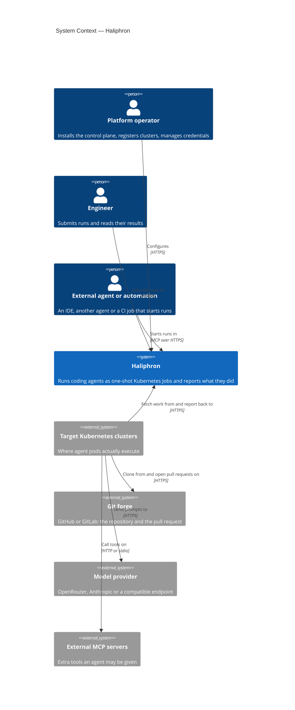
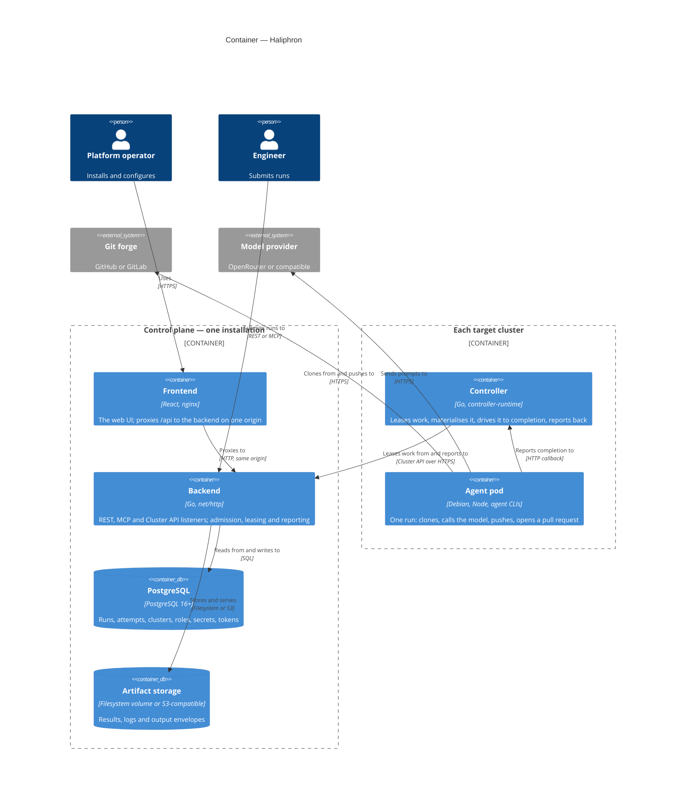

# About the architecture

Haliphron runs headless coding agents as one-shot Kubernetes Jobs, on request
from REST, MCP, Slack or a UI. It is delivered on-prem, single-tenant, as two
Helm charts.

That last sentence does more work than it looks. It is why there are two
charts rather than one, why the control plane holds no cluster credentials,
and why almost every awkward mechanism in the system — the long poll, the
epoch, the spool, the two deadlines — exists at all.

This page is the map. It describes the shape of the system as it is built
today, which is [phase 1 of five](#what-is-not-here-yet): the vertical slice
that takes one agent run from a request to an open pull request.

## The context

Note the direction of the arrow between Haliphron and the clusters. There is
one, and it points **out of** the cluster. Every other decision follows from
it; see [the pull model](the-pull-model.md).

Note also what is not in the diagram. There is no identity provider. The
design document describes one, and it is a reasonable thing to want, but
today the API accepts exactly one credential — a bearer token with scopes —
and the UI holds one in `localStorage`. Documenting an OIDC box that does not
exist would be documenting an intention.

### What happens when each of these fails

The failure behaviour is more informative than the box diagram, because it is
where the design's priorities show.

| External system | When it fails | What Haliphron does |
|---|---|---|
| Model provider | the agent cannot work | `failureClass=agent`; no automatic retry |
| Git forge | no clone, or no pull request | `infra` on the clone and retried; `git` on the push, and **the result is already saved** |
| Target cluster | stops fetching work | runs stay `Queued` with a reason; the cluster goes `Unreachable` |
| Object storage | no result | `CompletedWithoutResult` |
| The control plane | unavailable | work already taken is driven to completion; reports queue and are sent later |

The last row is the one to dwell on. A control plane being down is not
supposed to stop work that a cluster has already accepted. That is a
deliberate choice about which failures are allowed to propagate, and it costs
the spool, the epoch and the reconciliation protocol to honour.

## The containers

Six containers, in two groups that are installed separately and upgraded
independently.

The split in the diagram is the split in the charts: `haliphron` installs the
left-hand box once, `haliphron-runtime` installs the right-hand box in every
cluster that should run agents. A target cluster needs no database, no UI and
no engine, because it does none of that work.

### Why the MCP listener is not its own service

The backend serves four listeners from one binary: REST on 8080, MCP on 8081,
the Cluster API on 8082, health on 9090. It would be tidier, on an
architecture diagram, for MCP to be a service of its own.

It would also mean either duplicating database access and admission policy, or
adding a network hop to reach them. The real requirement behind the wish —
exposing MCP outward while REST stays inside the perimeter — is served by
installing the same chart twice with different `backend.mode` values. The mode
is part of the Service selector, so the two releases do not select each other's
pods.

That makes it a deployment decision rather than an architectural one, which is
the right category for it. Something that is only sometimes true of an
installation should not be permanently true of the code.

### Why the frontend is a separate container

The backend sends no CORS headers, and adding a browser-shaped authentication
model to it was not part of building this. So the UI lives on the API's own
origin: nginx serves `index.html` and forwards `/api` to the backend, and the
browser makes one same-origin request with no preflight.

This is a workaround with an honest name. A browser holding an `admin` token
is a browser holding the keys to every cluster, and the real fix is an
identity provider in front of the API. The arrangement buys time; it is not
the end state.

## How the layers are arranged

The backend is hexagonal, and the rule is enforced by convention rather than
by a linter: listeners are transport only, `app` holds every rule, `store` is
SQL.

The reason is stated plainly in the package comment of `backend/app/service.go`
and it is worth repeating, because it is the kind of rule that erodes one
convenient exception at a time: **the REST path and the MCP path must not
admit runs by different rules, and the ingest path and the heartbeat path must
not apply reports by different ones.**

Every way a run can be created converges on one `SubmitRequest`. Every way a
report can arrive converges on one application path. A new rule belongs in
`app`, not in whichever handler happened to surface the need for it. A system
with two admission policies does not know what it will accept, and finds out
one support conversation at a time.

The same shape appears in the controller, for the same reason: `lease` →
`materialize` → the `agentrun` reconciler → `launcher`. The reconciler is
where policy lives; the rest is mechanism.

## Four contracts, and why they are written down

The system is built at four seams — between the backend and the controller,
between the controller and Kubernetes, between the controller and the agent
pod, and between the backend and its database. Each has a document in
`docs/contracts/` that is normative rather than descriptive.

Three of the four separate components that were developed in parallel, against
fakes, before the other side existed. That is the immediate reason they were
written first. The lasting reason is different, and is covered in [why the
contracts are normative](why-the-contracts-are-normative.md): the documents
are load-bearing, and a test fails when the code and the prose disagree.

One convention worth internalising: machine contracts are **camelCase**, and
the public REST API is **snake_case**. The choice is arbitrary. Its uniformity
is not — mixing the two inside one contract is a reliable source of
translation bugs, and having a rule means never having the argument twice.

## Two stores, deliberately

PostgreSQL holds everything transactional: runs, the attempt ledger, clusters,
roles, secrets, tokens, the idempotency record. Artifact storage holds what is
large and immutable: results, logs, output envelopes.

The reason for the split is the reason it usually is — a database is a bad
place for blobs and a bucket is a bad place for a state machine — but the
second store is deliberately *optional*, and that is the less obvious
decision. An installation should be able to run its first agent without
standing up MinIO, so the default mode relays artifacts through the backend
onto a volume, and object storage is something you move to when one volume
stops being enough. See [artifact modes](artifact-modes.md).

The database is the system of record, and the schema does real work: the
`run_attempts_one_live` partial unique index, the `runs_close_attempt`
trigger, the domains that constrain every status. Rules that could live in Go
live in SQL where a second writer might otherwise get them wrong.

The schema is applied by the backend itself, at startup, before it binds a
port — and by *every* replica, not by a designated one. That sounds reckless
and is not: an advisory lock serialises them, so a rolling deploy waits for its
schema instead of starting half-migrated. The alternative, a migration Job
that must complete before the Deployment rolls, is a second thing to order
correctly and a second thing to get stuck. This way the ordering is a property
of the process rather than of the manifest, which is why the Deployment has a
startup probe with a long fuse and a liveness probe that does not touch the
database at all.

## What is not here yet

This is phase 1 of five. What exists is the vertical `run_agent` slice,
complete through every layer.

What does not exist, and is designed but unimplemented:

- **The workflow engine.** Chains of agents, branching, joining parallel
  branches. The domain model is worked out — it is the largest section of the
  design document — and none of it is built.
- **The scheduler.** Running on a schedule.
- **Multi-cluster placement by labels and capacity**, beyond the basic
  selector.
- **Tracing, dashboards, budgets, auditing as a product surface.**

Two things follow. First, the design document describes a larger system than
the one you can install; where the two disagree, this documentation set
describes what is built. Second, some mechanisms here look over-engineered for
what they currently do — the `writes` attribute, the depth limit on
agent-started runs, the structured output envelope — because they are load
paths for phases that have not arrived. That is a bet, and it may not pay off
evenly.

## Where to go next

The four ideas that explain most of the rest:

- [The pull model](the-pull-model.md) — why nothing connects into a cluster.
- [Leases, epochs and attempts](leases-epochs-and-attempts.md) — how the
  system stays correct when a cluster goes silent.
- [The untrusted agent pod](the-untrusted-agent-pod.md) — the one security
  assumption everything else is built around.
- [What "Succeeded" means](what-succeeded-means.md) — and what it deliberately
  does not.
